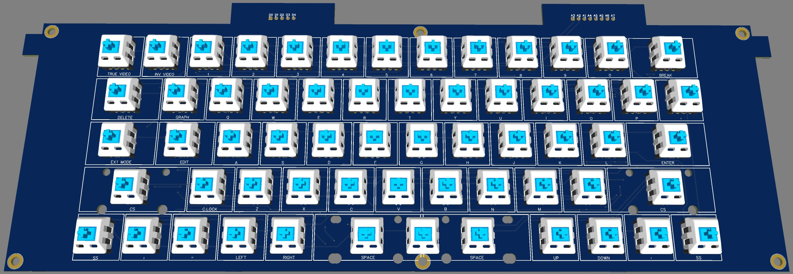

# ZX-Clone Delta-C mechanical keyboard

Проект реализации расширенной клавиатуры для отечественного ZX-Spectrum-совместимого компьютера Дельта-С.

Цель - разработка полного аналога пленочной клавиатуры компьютера Дельта-С, но на механических свичах, которая бы встала в штатные посадочные места без какой бы то ни было переделки корпуса.
Подключение клавиатуры штатными кабелями, без дополнительного питания.

## Дельта-С

Общий вид

Дельта-С в разобраннном виде:

Подробнее о Дельта-С можно прочитать тут:
- https://dzen.ru/a/Y7U3m4OKTEwFWnLi

## Плата клавиатуры на механический свичах
Размеры платы и клавиатурного поля

Размеры и количество кнопок (KeyCaps)
|     Клавиша      | Размер | Количество | Цвет  |
| :--------------: | :----: | :--------: | :---: |
| Delete, Ext.Mode |  1.5U  |     2      | XDA9  |
|      Break       |  1.5U  |     1      | XDA7  |
|       Edit       | 1.25U  |     1      | XDA9  |
|      Enter       | 1.75U  |     1      | XDA9  |
|    Caps Shift    | 2.25U  |     2      | XDA9  |
|    Inv Video     |   1U   |     1      | XDA9  |
|    True Video    |   1U   |     1      | XDA9  |
|    Caps Lock     |   1U   |     1      | XDA9  |
|      Graph       |   1U   |     1      | XDA9  |
|   Symbol Shift   |   1U   |     2      | XDA9  |
|   Double Space*  | 2.25U  |     2      | XDA29 |
|   Single Space   |  4.5U  |     1      | XDA29 |
|    Other keys    |   1U   |     45     | XDA1  |
|    Всего         |        |     59     |клавиш |

* на место пробела устанавливается либо одна клавиша 4.5U, либо две клавиши 2.25U

Цветовая палитра кнопок [продавца AliExpress](https://aliexpress.ru/item/1005003253753213.html?spm=a2g2w.cart.cart_split.21.6e164aa6YSi6ua&sku_id=12000024872209815&_ga=2.226099802.1943549303.1703079457-1957729545.1670592979/)

Вид 2D с лицевой стороны

Вид 2D с обратной стороны

Вид 3D с лицевой стороны

Вид 3D с обратной стороны

Принципиальная схема клавиатуры

Схема разработана по мотивам опубликованной PokeMon на форуме [www.sinclairzxworld.com](https://www.sinclairzxworld.com/viewtopic.php?t=1777) [схемы](https://www.sinclairzxworld.com/download/file.php?id=2645&sid=b241b771a1777453060055383eb7e17b) для ZX Spectrum Plus / Spectrum 128k.

Перечень компонентов: [BOM](/doc/Delta-C_Keyboard_BOM.pdf)

Gerber-Файл для изготовления платы: [Gerber](https://github.com/AlexPodlesnov/ZX-Clone-Delta-C-mechanical-keyboard/tree/main/doc)

Лазерная гравировка клавиш: +7(499)755-75-44, [www.laserskills.ru](https://laserskills.ru/), zakaz@laserskills.ru

Печатная плата в корпусе

Печатная плата с монтажом компонентов

Клавиатура в сборе

Клавиатура в корпусе

Компьютер с новой клавиатурой

